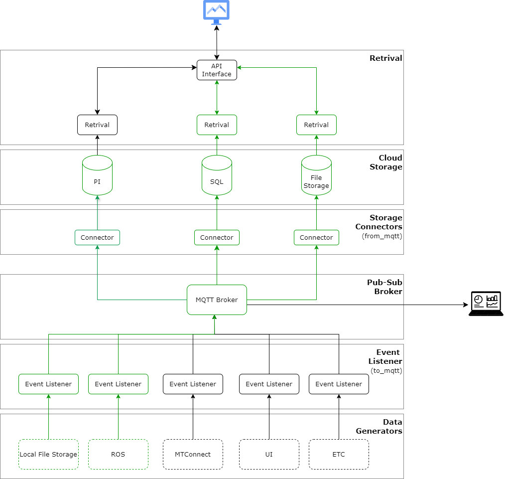

# Digital Data Backbone

```{contents}
```
## Overview

*insert some text*


## Layers

This will provide descriptions of each layer.

### Data Generators
The layer shows some example of current and future generators of information for the digital backbone. These sources are responsible for generating data that will be collected and processed by the system.
### Event Listener
Event listeners monitor the data generators for events. They listen for data changes or updates from the data generators and pass the information to the MQTT Broker.
### Pub-Sub Broker
The MQTT Broker acts as the central communication hub in the pub-sub model. It receives messages from event listeners and distributes them to the appropriate connectors based on specified subscriptions.
### Storage Connectors
These connectors subscribe to the MQTT Broker to receive data. They facilitate the transfer of data from the broker to the various storage systems (PI, SQL, File Storage).
### Cloud Storage
The cloud storage layer deliniates different storage solutions where data is stored. 
### Retrieval
This layer provides retrieval services that can access data stored in the cloud storage.

## Software

<a href="https://github.com/cmu-mfi/dbb_interfaces.git" class="inline-button"><i class="fab fa-github"></i>dbb_interfaces</a>

The github repository is organized as shown below. `from_mqtt` has modules for various "Connectors" in the "Storage Connector" layer, and similarly `to_mqtt` has modules for "Event Listener" layer.


```
├───from_mqtt
│   ├───mqtt_cfs
│   ├───mqtt_pi
│   └───mqtt_sql
│       └───XMLtoSQL
└───to_mqtt
│   ├───lfs_mqtt
│   ├───ros_mqtt_cfs
│   └───ros_mqtt_pi
└───retrieval
    ├───RetrievalFiles
```
