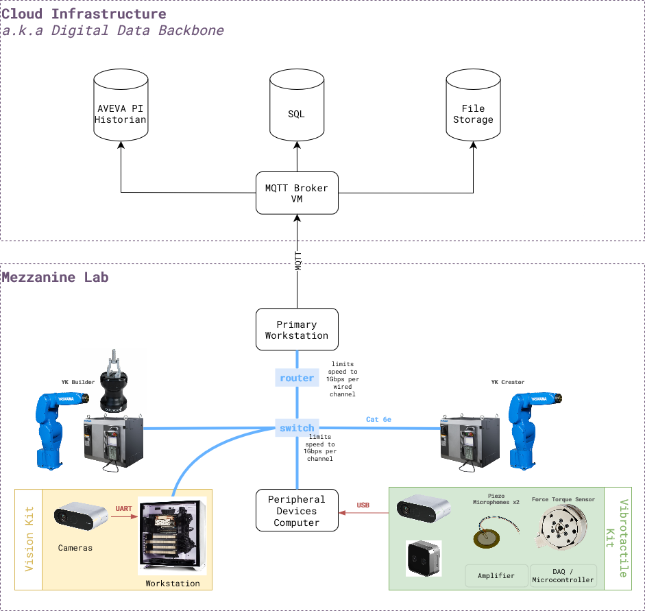
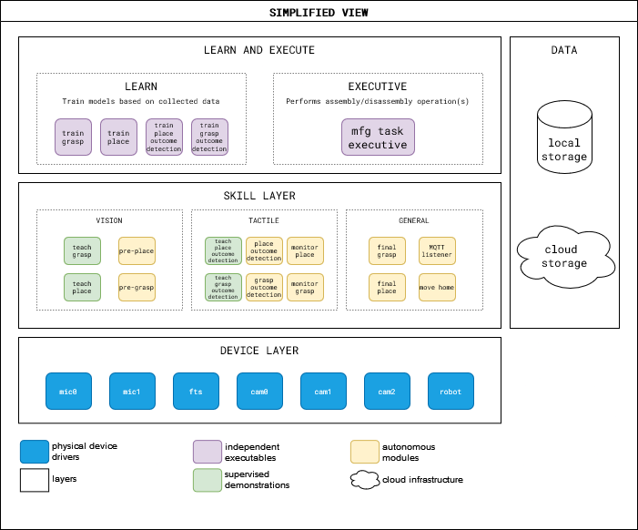
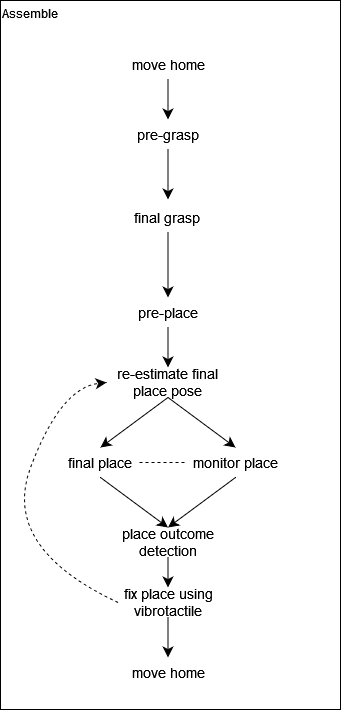

# System Overview

<!-- ```{toctree}
:maxdepth: 2

System/Hardware.md
System/Software.md
System/RobotSkills.md
System/RobotTasks.md

``` -->

The diagram below shows how various equipment, sensors and virtual machines are connected to one another. Few key points to note:

* The physical hardware of the cloud infrastructure is on CMU main campus
* Mezzanine Lab equipment is located at Mill19 campus of CMU
* The system is setup at one of the CMU labs [Mezzanine Lab](https://engineering.cmu.edu/mfi/facilities/equipment-details/mezzanine-lab.html). Multiple workstations and robots facilitate parallel research and engineering work on multiple "thrusts" of the project.
*  

| <br>  <br> System Implementation at Mezzanine Lab|
|:--:|
|  <br> Proposed Simplified Setup|


### BOM

Here is a link to the [BOM sheet](https://docs.google.com/spreadsheets/d/1p2As_AB7A4FWpQJU8ZtA_rXWKELAA8dq/edit?usp=sharing&ouid=112281614924032477147&rtpof=true&sd=true).


<!-- ## Software

Simplified view of the integrated system software stack is given below.

*work in progress*



## Task Execution

A manufacturing task, like inserting a male connector to a female connector, is executed by using both vision and vibrotactile skills of the system. Below is a high-level flow diagram of how different skills are executed to fulfill a task to assemble a connector.

 -->