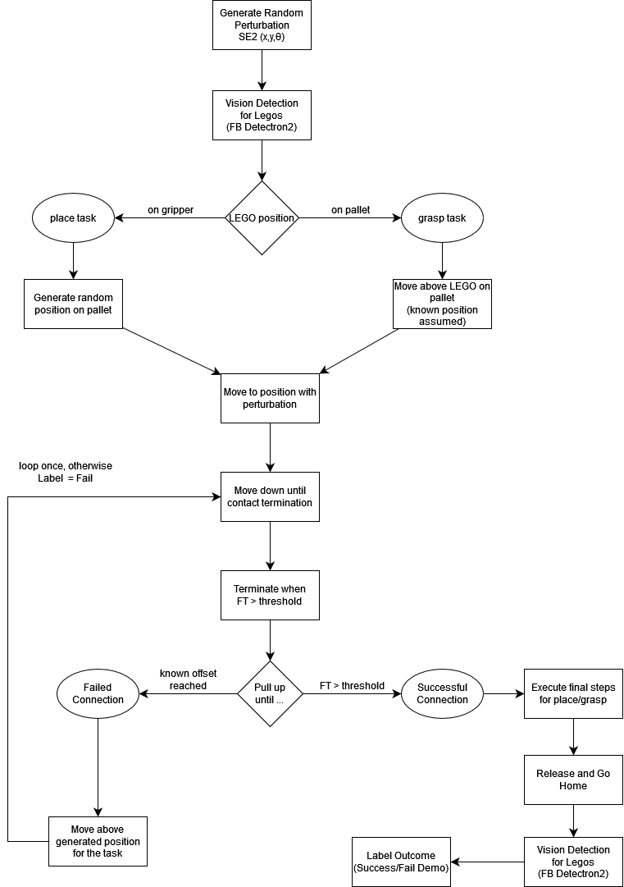
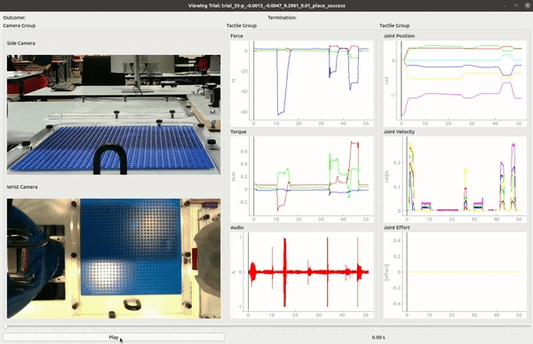
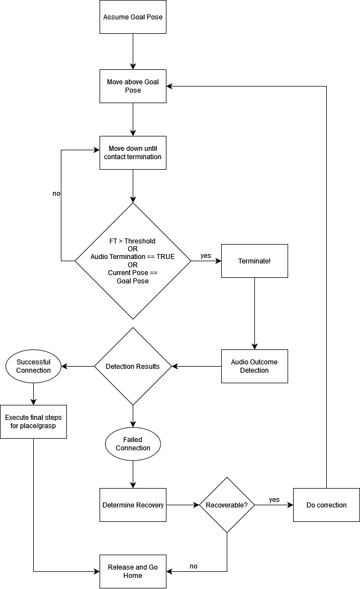

# Vibrotactile

*images*

```{contents}
```

## TEACH: Data Collection





## LEARN: Model Training

For the vibrotactile pick/place skills, models are required for following:

| Skill | Data Inputs |
|-------|-------------|
|audio-based outcome detection| audio spectogram images (1s) |
|audio-based termination | audio spectogram images (0.1s) |

## EXECUTE: Model Inference

