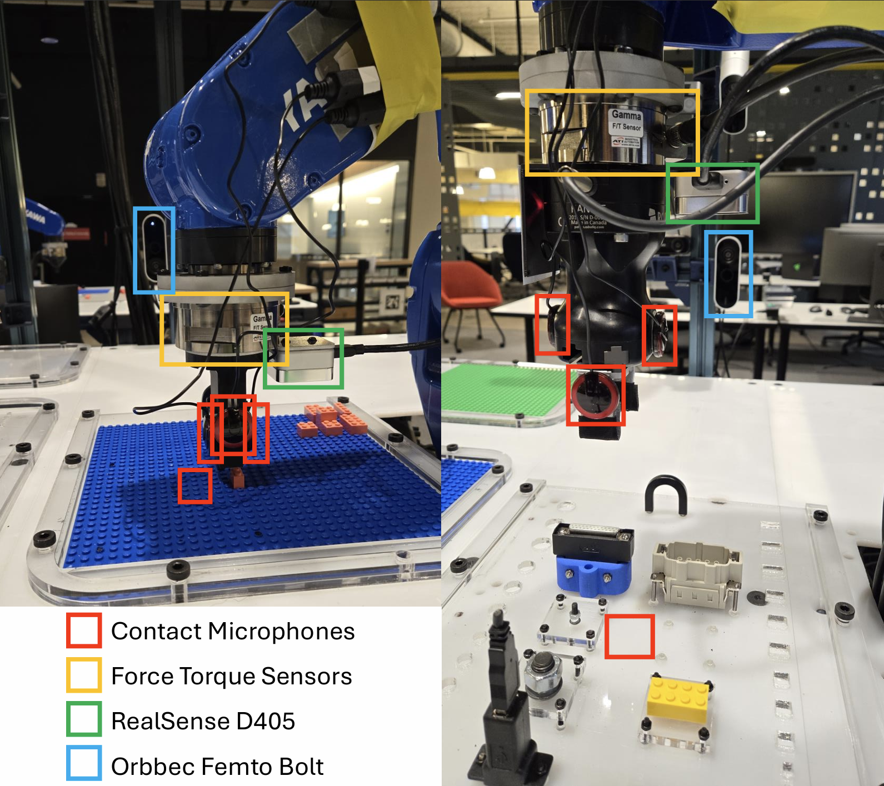
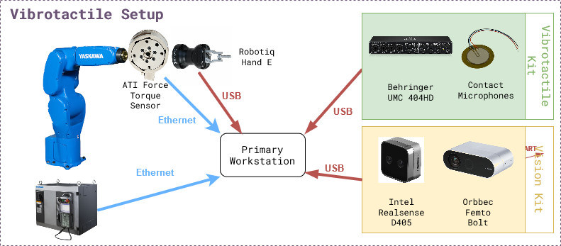

# Vibrotactile System - Installation



```{contents}

```

## Hardware

The figure below shows the experiment setup. The list of hardware components can be also be found in the [BOM sheet](https://docs.google.com/spreadsheets/d/1p2As_AB7A4FWpQJU8ZtA_rXWKELAA8dq/edit?usp=sharing&ouid=112281614924032477147&rtpof=true&sd=true).


### Mandatory

| Name                                        | Suggested Order Link                                                                                                                                                                                                                                                                                                                                                                                                                                                                                                                                                                                                                   | Quantity | Price   | Total Cost |
| ------------------------------------------- | -------------------------------------------------------------------------------------------------------------------------------------------------------------------------------------------------------------------------------------------------------------------------------------------------------------------------------------------------------------------------------------------------------------------------------------------------------------------------------------------------------------------------------------------------------------------------------------------------------------------------------------- | -------- | ------- | ---------- |
| Behringer UMC 404HD                         | [B&H Photo Video](https://www.bhphotovideo.com/c/product/1821221-REG/behringer_umc404hd_audiophile_4x4_24_bit_192_khz.html?ap=y&smp=Y)                                                                                                                                                                                                                                                                                                                                                                                                                                                                                                 | 1        | $109.00 | $109.00    |
| 5 Pack of Piezoelectric Contact Microphones | [Amazon](https://www.amazon.com/TIMESETL-Microphone-Self-Adhesive-Instrument-Mandolin/dp/B07ZTBVKRD/ref=sr_1_5?crid=1OHNBI7Y4OM4U&dib=eyJ2IjoiMSJ9.-PibDNlinRz79bIpdumGJHAAdW3PdumsNrUWTrBZB4hYry4WdTr78zPfu4ZnYQWFlwNLi0yY8THnebiukewvbaDljZXfaSdQ0njt5TC4QlHQUbw-4_M51b1tVUYlgZl6bLj9okH0wZqaFYOOhAo4upt3WI4d1Tj6ApClqPZNZep-iIMk3dItQ0ypgfMbxqWdPuSmfoJVkW-mXZQSGQE25jBOfYMTwTv_7UsH_2RJuBoABTUdnXDijXNkBa1PxqxMXAsXIjy9HopNVacSJfhPereGmHMmK3gLGBOpPmN7eJc.JVs0GaesD3pa5oN6mlhvDtEM4Jdsj8TEvta9yf8iEBU&dib_tag=se&keywords=contact+microphone&qid=1728404098&sprefix=contact+microphone%2Caps%2C116&sr=8-5)                        | 1        | $14.99  | $14.99     |
| Cable Matters 2-Pack 1/4 Inch Cable 6 Feet  | [Amazon](https://www.amazon.com/Cable-Matters-2-Pack-Straight-Instrument/dp/B073RMQKYG/ref=sr_1_5?crid=3CAXQV30GAW34&dib=eyJ2IjoiMSJ9.Kt4WgCJJxKgRCeq0DAJKS-hNN4erYY2vaNujsRJ79_VO1tDk5Lk_iwploE1cLZ84vf7-BUaTykY2GWsQ-ok3Cxo31LQ-_hUiD-dSBHQGE66CwqGDRkAYst0p9N8vxKShFFfwDUwgWAv5Zr7fwUBfH6WKmorjgqEohj5LpuAUZSFXZHCbsmui-RZapHChPC0qWVZIvvXxeVhLABGOOtuXiKXuITo_nMy1gSxIlrr5y5yHl3O_oRLR_WkkS9XHgQiJUMZWROeesGbWotCmyGCRZQ21p-_ISN1SPshgiikzoZc.UjQgkGwOghuAMmPTfaykA48QvzMRfXTSK0Cc3Xy4KKg&dib_tag=se&keywords=1%2F4%2Bto%2B1%2F4%2Baudio%2Bcable&qid=1728404189&sprefix=1%2F4%2Bto%2B1%2F4%2Baudio%2Bcabl%2Caps%2C112&sr=8-5&th=1) | 2        | $9.99   | $18.98     |
| 5952 VHB Tape: 2.5cm x 15 ft                | [Amazon](https://www.amazon.com/3M-Scotch-5952-VHB-Tape/dp/B01BU7038A/ref=sr_1_5?crid=3H9RB26LUQG7O&dib=eyJ2IjoiMSJ9.Ij13Xm94FJr9PZn3aLfDPpOQpL0kG5guXpqFnrtxxApBgO0D4_uru2Ya49socXCKt5_lS1IyyK-f2AFkj_JdW1nJqTNxcJqE6c0EUpz9_DOc1_U379iAkGnTiFRQaadsdrcnWBLYHFkT-ZXK5OC1fCDohgApHC7BwbDJ-ecp2gXJpj-4Ydpq2VgP8zKaCT-Ue_GTKiRmtjZBTlUEcu3XDjyv7lHTFG1vEs_tZeiESQg.eMBWUCijaoBW8H9EShv5IFQmyg74ExMHGe5X_Q8d4eU&dib_tag=se&keywords=VHB+tape&qid=1710778116&sprefix=vhb+tape%2Caps%2C92&sr=8-5#customerReviews)                                                                                                                           | 1        | $13.99  | $13.99     |
| ATI Gamma Net Type SI-32-2.5                | [ATI](https://www.ati-ia.com/products/ft/ft_models.aspx?id=Gamma)                                                                                                                                                                                                                                                                                                                                                                                                                                                                                                                                                                      | 1        | ~$6000  | ~$6000     |

### Optional

| Name                                              | Suggested Order Link                                                                 | Quantity | Price   | Total Cost |
| ------------------------------------------------- | ------------------------------------------------------------------------------------ | -------- | ------- | ---------- |
| Intel Realsense D405                              | [Intel](https://store.intelrealsense.com/buy-intel-realsense-depth-camera-d405.html) | 1        | $272.00 | $272.00    |
| Orbbec Femto Bolt                                 | [Orbbec](https://store.orbbec.com/products/femto-bolt)                               | 1        | $418    | $418       |
| Amazon Basics USB-A 3.0 Extension Cable, 3 Meters | [Amazon](https://www.amazon.com/dp/B00NH12O5I?th=1)                                  | 2        | $8.54   | $17.08     |

## Software

There are two levels of software installation required for the vibrotactile system.

Relevant repositories:\
<a href="https://github.com/cmu-mfi/motoman_ros1" class="inline-button"><i class="fab fa-github"></i>motoman_ros1</a>
<a href="https://github.com/cmu-mfi/vibro_tactile_toolbox" class="inline-button"><i class="fab fa-github"></i>vibro_tactile_toolbox</a>

**1. Device Interfaces**\
This includes the installation of the software required to interface with the hardware components like robots, cameras, grippers, etc.

ROS Nodes for the devices can be launched using the `docker-compose.yml` file in the `docker/` directory. It will need modification if using other hardware, like different cameras.

**2. Vibrotactile System**\
This includes the installation of the software required to run the vibrotactile system which involves the teach, learn and execute tasks described in the [overview](Vibrotactile.md) section.

### Installation Steps

1. **Step 1: Device Interfaces**
   
   - Make sure the devices are connected and working properly.
   
   - Make sure you connect a monitor to the computer that is connected to the UMC404HD Audio Interface and log into Ubuntu once before following the instructions below.
   
   - Prerequisites for the vibrotactile system: one robot arm, 2-4 contact microphones, one force torque sensor, one side camera, and one gripper.
   
   - You will need to add a couple of lines to your `~/.bashrc` file with the proper ip addresses:
     
     ```shell
       export ROS_IP=<your computer ip>
       export ROS_MASTER_URI=http://<rosmaster computer ip>:11311
     ```
   
   - Make sure the motoman ros1 docker is working with a robot namespace.
   
   - Make sure the force torque sensor is publishing on the `/<robot namespace>/fts` topic.
     
     ```shell
     cd Documents
     git clone https://github.com/cmu-mfi/vibro_tactile_toolbox.git 
     cd vibro_tactile_toolbox/docker
     bash build_docker.sh
     TYPE=nist NAMESPACE=<robot namespace> docker compose up --build
     ```
     
     > Note: If using different hardware, modify the `docker-compose.yml` file accordingly.
     > 
     > <br>

2. **Step 2: Systems Check**
   
   - Run the system check test file
     
     ```
     cd ~/Documents/vibro_tactile_toolbox/docker
     ./run -i vibro_tactile_toolbox:noetic -c vibro_tactile_toolbox_container -g
     cd /home/Documents/vibro_tactile_toolbox
     python tests/test_system.py -t nist -n <robot namespace>
     ```

3. **Step 3: Modify/Create Config Files**
   
   - You can modify the config files in the config folder such as `lego.yaml` and `nist.yaml`. Some key options to pay attention to are the `data_dir` which is the folder to save the data and `force_threshold` as your force torque sensor may feel a different force with different connectors. The `force_threshold` under `pull up` is the force at which to stop the robot when lifting while the `force_threshold` under `fts_detector` is the `z` force difference to determine whether the connector made a good connection or not.
   
   - Also if your end effector to robot transformation is different, you will need to modify the file `transforms/hande_ee.tf` or `transforms/lego_ee.tf` to account for the differences.
   
   - Open `rqt` or `rqt_image_view` and make sure that the image:
     
     **/<robot_namespace>/side_camera/color/image_cropped/compressed**
     
     is properly cropped and rotated. To modify it, go to the `launch/orbbec.launch` file and change the `x_offset`, `y_offset`, and `rotation_direction`. If you change the file, you will need to rerun the following commands in order to update the docker image with the changes:
     
     ```shell
     cd ~/Documents/vibro_tactile_toolbox/docker
     TYPE=nist NAMESPACE=<robot namespace> docker compose up --build
     ```

4. **Step 4: TEACH - Collect training data**
   
   1. NIST Connectors
   - The first step to teach a new connector is to place the connector at a consistent and repeatable location such as a corner. For this tutorial, I will be pretending to use an ethernet cable, but you can subsitute the word `ethernet` with whichever connector you would like.
   
   - Next, you will need to open the robot's gripper if you are using the Robotiq Hand E.
   
   - If the vibro_tactile_toolbox_container is already running, you can just create a new terminal using the command:
     
     ```
     cd ~/Documents/vibro_tactile_toolbox/docker
     bash new_terminal.sh
     ```
   
   - Otherwise you can start the vibro_tactile_toolbox_container with the command:
     
     ```
     cd ~/Documents/vibro_tactile_toolbox/docker 
     ./run -i vibro_tactile_toolbox:noetic -c vibro_tactile_toolbox_container -g
     ```
   
   - To open the Robotiq Hand E gripper, you need to run the following command in the docker container.
     
     ```
     rosrun robotiq_mm_ros open_gripper.py
     ```
   
   - Then you will jog the robot so that when it closes it's fingers, it can perfectly pick up the connector. You can test the position by opening and closing the gripper and seeing if the connector moves from the original position.
     
     ```
     rosrun robotiq_mm_ros close_gripper.py
     rosrun robotiq_mm_ros open_gripper.py
     ```
   
   - After you are satisfied with the robot pose, you will need to run the `save_hande_pose` launch file to save the current robot pose.
     
     ```
     roslaunch vibro_tactile_toolbox save_hande_pose.launch namespace:=<robot namespace> 
     ```
   
   - The resulting saved pose will be located in the folder `/ros1_ws/src/vibro_tactile_toolbox/transforms/` in the file `hande_world.tf`. You can easily navigate to the folder by running the following command:
     
     ```
     roscd vibro_tactile_toolbox/transforms
     ```
   
   - You can verify that the file has changed by running the following command:
     
     ```
     git status
     ```
   
   - You will now need to move the saved hande pose file to the vibro_tactile_toolbox folder outside of the docker using the following command:
     
     ```
     cp hande_world.tf /home/Documents/vibro_tactile_toolbox/transforms/
     ```
   
   - Once you have run the above commands, you can create a new terminal outside of the docker to verify that the transform has been moved.
     
     ```
     cd ~/Documents/vibro_tactile_toolbox/transforms/
     git status
     ```
   
   - Next you will need to create a new folder in transforms that represents the name of the connector such as ethernet.
     
     ```
     mkdir ethernet
     ```
   
   - Afterwards, move the saved transform in and name it `world_pick.tf`
     
     ```
     mv hande_world.tf ethernet/world_pick.tf
     ```
   
   - Now you will need to close the robot's gripper and then jog the robot to the designated place pose where the connector in the Robotiq gripper is fully inserted into the receptacle. Again you will run the `save_hande_pose.launch` file inside the docker container.
     
     ```
     roslaunch vibro_tactile_toolbox save_hande_pose.launch namespace:=<robot namespace>
     ```
   
   - Then you will again copy the pose file to the vibro_tactile_toolbox_folder outside of the docker and name it `world_place.tf`.
     
     ```
     roscd vibro_tactile_toolbox/transforms
     cp hande_world.tf /home/Documents/vibro_tactile_toolbox/transforms/ethernet/world_place.tf
     ```
   
   - Next step, you can take a look at the launch file `collect_nist_audio_data.launch` inside of `~/Documents/vibro_tactile_toolbox/launch` and make any desired modifications such as the number of trials to collect.
   
   - Afterwards, it is very important to close all the previous docker containers and then run the following command in a terminal:
     
     ```
     cd ~/Documents/vibro_tactile_toolbox/docker
     TYPE=nist NAMESPACE=<robot namespace> docker compose up --build
     ```
   
   - Then once the docker containers have started, run the check again:
     
     ```
     cd ~/Documents/vibro_tactile_toolbox/docker
     ./run -i vibro_tactile_toolbox:noetic -c vibro_tactile_toolbox_container -g
     cd /home/Documents/vibro_tactile_toolbox
     python tests/test_system.py -t nist -n <robot namespace>
     ```
   
   - Finally to start the data collection, you will run:
     
     ```
     roslaunch vibro_tactile_toolbox collect_nist_audio_data.launch namespace:=<robot_namespace> connector_type:=ethernet
     ```
   
   - Keep an eye on the robot and hold onto the connector when the robot releases it. If the force torque predictions are incorrect, you will need to adjust the `force_thresholds` in `config/nist.yaml`.
   2. LEGO
   - For the lego task, we will be assuming that the lego board is fixed. You will need to register multiple positions on the board within a region. 
   
   - First you will need to download my trained lego detector model from [here](https://drive.google.com/file/d/1SGcNrUVqfxy641kZhhMAM2H9WvDHTupR/view?usp=drive_link). Then you will move it into a models folder in vibro_tactile_toolbox.
     
     ```
     cd ~/Documents/vibro_tactile_toolbox
     mkdir models
     mv ~/Downloads/lego_model.pth models/
     ```
   
   - Next you will need to make sure the docker containers are closed and start the docker compose up with the lego flag:
     
     ```shell
     cd ~/Documents/vibro_tactile_toolbox/docker
     TYPE=lego NAMESPACE=<robot namespace> docker compose up --build
     ```
   
   - Next you will need to start the vibro_tactile_toolbox_container with the command:
     
     ```
     cd ~/Documents/vibro_tactile_toolbox/docker 
     ./run -i vibro_tactile_toolbox:noetic -c vibro_tactile_toolbox_container -g
     ```
   
   - Then, you should remove all of the previously taught locations in the `/ros1_ws/src/vibro_tactile_toolbox/transforms/T_lego_world/` folder using the following command:
     
     ```
     rm -rf /ros1_ws/src/vibro_tactile_toolbox/transforms/T_lego_world/*
     ```
   
   - To register a lego pose, use the teach pendant to jog the robot so that it is pushing a 2x1 lego block down onto the lego board. Figure out the peg's x,y location by using the top left peg of the board as 0,0 and decreasing x towards the robot and increasing the y location from left to right. Use the following command to save the lego pose:
     
     ```
     roslaunch vibro_tactile_toolbox save_lego_pose.launch namespace:=<robot namespace> x:=<current x position> y:=<current y position>
     ```
   
   - The lego pose will then be saved in the folder `/ros1_ws/src/vibro_tactile_toolbox/transforms/T_lego_world/` with the file name `lego_world_<current x position>_<current_y_position>.tf`.
   
   - Once you have taught around 8 locations around the board, you will need to move all of the transforms outside of the docker using the following commands:
     
     ```
     rm -rf /home/Documents/vibro_tactile_toolbox/transforms/T_lego_world/
     cp -r /ros1_ws/src/vibro_tactile_toolbox/transforms/T_lego_world /home/Documents/vibro_tactile_toolbox/transforms/
     ```
   
   - Next, you can take a look at the launch file `collect_lego_audio_data.launch` inside of `~/Documents/vibro_tactile_toolbox/launch` and make any desired modifications such as the number of trials to collect.
   
   - Afterwards, it is very important to close all the previous docker containers and then run the following command in a terminal:
     
     ```
     cd ~/Documents/vibro_tactile_toolbox/docker
     TYPE=lego NAMESPACE=<robot namespace> docker compose up --build
     ```
   
   - Then once the docker containers have started, run the check again:
     
     ```
     cd ~/Documents/vibro_tactile_toolbox/docker
     ./run -i vibro_tactile_toolbox:noetic -c vibro_tactile_toolbox_container -g
     cd /home/Documents/vibro_tactile_toolbox
     python tests/test_system.py -t lego -n <robot namespace>
     ```
   
   - Finally to start the data collection, you will run:
     
     ```
     roslaunch vibro_tactile_toolbox collect_lego_audio_data.launch namespace:=<robot_namespace> block_type:=<your current block type>
     ```
   
   - Keep an eye on the robot and stop the data collection script if the lego flies off the board. If the force torque predictions are incorrect, you will need to adjust the `force_thresholds` in `config/lego.yaml`. If the lego vision predictions are incorrect, you will need to adjust the top_bbox and bot_bbox in the `lego_detector` in `config/lego.yaml`.

5. **Step 5: LEARN - Train the models**
   
   - If you want to download sample data, you can download them [here](https://drive.google.com/drive/folders/1_JnpDF9Mceyzx34Hz1qKBsjdGAOaGSJM?usp=drive_link) and unzip them into your Documents/vibro_tactile_data folder.
   1. NIST Connectors
      
      - To create the NIST dataset, you will need to modify the script in `convenience_scripts/make_nist_dataset.sh`.
      
      - Basically VOLS represents the volumes you have collected data at. CONNECTORS represents the connectors that you have collected data with. If you only collected `ethernet` you would only have "ethernet" in the (). VELS represents the velocities that you have collected data at. TRAIN_VS_TEST represents whether you have collected test data yet or not. If you haven't you would just have "vel_" in there. Finally ROBOT_NAME is the robot's namespace. For example, you could modify it to be:
        
        ```
        VOLS=(75)
        CONNECTORS=("ethernet")
        VELS=(0.01)
        TRAIN_VS_TEST=("vel_")
        ROBOT_NAME="<robot namespace>"
        ```
   
   2. LEGO
      
      - To create the Lego dataset, you will need to modify the script in `convenience_scripts/make_lego_dataset.sh`.
      
      - Basically VOLS represents the volumes you have collected data at. BRICKS represents the brick types that you have collected data with. If you only collected `2x1` you would only have "2x1" in the (). VELS represents the velocities that you have collected data at. TRAIN_VS_TEST represents whether you have collected test data yet or not. If you haven't you would just have "vel_" in there. Finally ROBOT_NAME is the robot's namespace. For example, you could modify it to be:
        
        ```
        VOLS=(75)
        BRICKS=("2x1") 
        VELS=(0.01)
        TRAIN_VS_TEST=("vel_")
        ROBOT_NAME="<robot namespace>"
        ```
   
   3. Training the outcome and terminator models
      
      - To train the audio outcome and terminator models, you will need to modify the script in `convenience_scripts/train_outcome_and_terminator_models.sh` and `convenience_scripts/test_trained_outcome_and_terminator_models.sh`. 
      
      - Basically TYPES represents the type of connector you have collected data with and CHANNELS represents the audio channels you want to use. For example, training all of the audio channels for ethernet would result in:
        
        ```
        TYPES=("ethernet")
        CHANNELS=("0,1,2,3")
        ```
      
      - On the other hand training all of the audio channels for lego would result in:
        
        ```
        TYPES=("lego")
        CHANNELS=("0,1,2,3")
        ```
   
   4. After you have made the changes to the `convenience_scripts", you will need to again run:
      
      ```
      cd ~/Documents/vibro_tactile_toolbox/docker
      TYPE=nist NAMESPACE=<robot namespace> docker compose up --build
      ```
      
      - Then once the dockers have been built, you will run:
        
        ```
        cd ~/Documents/vibro_tactile_toolbox/docker
        ./run -i vibro_tactile_toolbox:noetic -c vibro_tactile_toolbox_container -g
        roscd vibro_tactile_toolbox
        bash convenience_scripts/make_nist_dataset.sh
        bash convenience_scripts/make_lego_dataset.sh
        bash convenience_scripts/train_outcome_and_terminator_models.sh
        bash convenience_scripts/test_trained_outcome_and_terminator_models.sh
        ```
   
   5. Once the models have been trained, move them out of the docker to the models folder in `~/Documents/vibro_tactile_toolbox`:
      
      ```
      cp -r /ros1_ws/src/vibro_tactile_toolbox/models/* /home/Documents/vibro_tactile_toolbox/models/
      ```

6. **Step 6: EXECUTE - Validate the system**
   
   1. To download already pretrained models, you can download them [here](https://drive.google.com/drive/folders/1QPUI7IPVllI9K_c3E34HhZLIIfjEob0-?usp=drive_link) and extract them into the `~/Documents/vibro_tactile_toolbox/models` folder.
   
   2. Next you will need to take a look at the `test_nist_audio_outcome.launch` and `test_lego_audio_outcome.launch` files and make changes depending on your preferences.
   
   3. Finally you will need to start the docker container using the following command for ethernet:
      
      ```
      cd ~/Documents/vibro_tactile_toolbox/docker
      TYPE=nist NAMESPACE=<robot namespace> docker compose up --build
      ```
   
   4. Finally to start the nist evaluation, you will run:
      
      ```
      roslaunch vibro_tactile_toolbox test_nist_audio_outcome.launch namespace:=<robot_namespace> connector_type:=ethernet
      ```
   
   5. For lego you will instead run:
      
      ```
      cd ~/Documents/vibro_tactile_toolbox/docker
      TYPE=lego NAMESPACE=<robot namespace> docker compose up --build
      ```
      
       and
      
      ```
      roslaunch vibro_tactile_toolbox test_lego_audio_outcome.launch namespace:=<robot_namespace> block_type:=<your current block type>
      ```