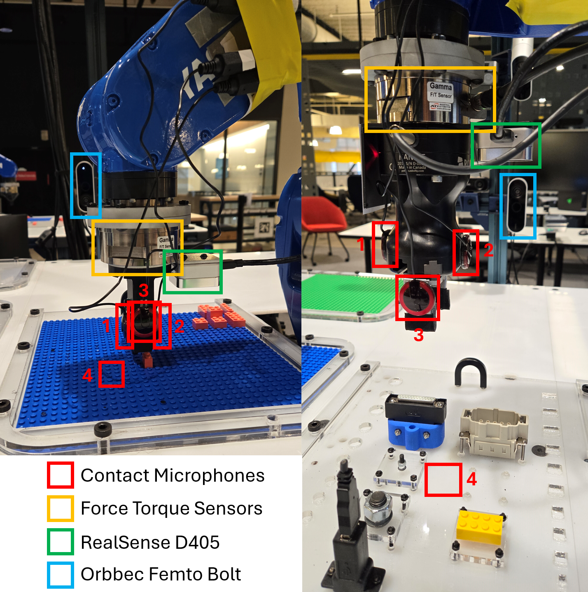

# Vibrotactile System - Installation



```{contents}
```

## Hardware 

The figure below shows the experiment setup. The list of hardware components can be found below as well as in the [BOM sheet](https://docs.google.com/spreadsheets/d/1p2As_AB7A4FWpQJU8ZtA_rXWKELAA8dq/edit?usp=sharing&ouid=112281614924032477147&rtpof=true&sd=true).


### Mandatory
| Name | Suggested Order Link | Quantity | Price | Total Cost|
|-------|-------------|-------------|-------------|-------------|
| Behringer UMC 404HD | [B&H Photo Video](https://www.bhphotovideo.com/c/product/1821221-REG/behringer_umc404hd_audiophile_4x4_24_bit_192_khz.html?ap=y&smp=Y) | 1 | $109.00 | $109.00 |
| 5 Pack of Piezoelectric Contact Microphones | [Amazon](https://www.amazon.com/TIMESETL-Microphone-Self-Adhesive-Instrument-Mandolin/dp/B07ZTBVKRD/ref=sr_1_5?crid=1OHNBI7Y4OM4U&dib=eyJ2IjoiMSJ9.-PibDNlinRz79bIpdumGJHAAdW3PdumsNrUWTrBZB4hYry4WdTr78zPfu4ZnYQWFlwNLi0yY8THnebiukewvbaDljZXfaSdQ0njt5TC4QlHQUbw-4_M51b1tVUYlgZl6bLj9okH0wZqaFYOOhAo4upt3WI4d1Tj6ApClqPZNZep-iIMk3dItQ0ypgfMbxqWdPuSmfoJVkW-mXZQSGQE25jBOfYMTwTv_7UsH_2RJuBoABTUdnXDijXNkBa1PxqxMXAsXIjy9HopNVacSJfhPereGmHMmK3gLGBOpPmN7eJc.JVs0GaesD3pa5oN6mlhvDtEM4Jdsj8TEvta9yf8iEBU&dib_tag=se&keywords=contact+microphone&qid=1728404098&sprefix=contact+microphone%2Caps%2C116&sr=8-5) | 1 | $14.99 | $14.99 |
| Cable Matters 2-Pack 1/4 Inch Cable 6 Feet | [Amazon](https://www.amazon.com/Cable-Matters-2-Pack-Straight-Instrument/dp/B073RMQKYG/ref=sr_1_5?crid=3CAXQV30GAW34&dib=eyJ2IjoiMSJ9.Kt4WgCJJxKgRCeq0DAJKS-hNN4erYY2vaNujsRJ79_VO1tDk5Lk_iwploE1cLZ84vf7-BUaTykY2GWsQ-ok3Cxo31LQ-_hUiD-dSBHQGE66CwqGDRkAYst0p9N8vxKShFFfwDUwgWAv5Zr7fwUBfH6WKmorjgqEohj5LpuAUZSFXZHCbsmui-RZapHChPC0qWVZIvvXxeVhLABGOOtuXiKXuITo_nMy1gSxIlrr5y5yHl3O_oRLR_WkkS9XHgQiJUMZWROeesGbWotCmyGCRZQ21p-_ISN1SPshgiikzoZc.UjQgkGwOghuAMmPTfaykA48QvzMRfXTSK0Cc3Xy4KKg&dib_tag=se&keywords=1%2F4%2Bto%2B1%2F4%2Baudio%2Bcable&qid=1728404189&sprefix=1%2F4%2Bto%2B1%2F4%2Baudio%2Bcabl%2Caps%2C112&sr=8-5&th=1) | 2 | $9.99 | $18.98 | 
| 5952 VHB Tape: 2.5cm x 15 ft | [Amazon](https://www.amazon.com/3M-Scotch-5952-VHB-Tape/dp/B01BU7038A/ref=sr_1_5?crid=3H9RB26LUQG7O&dib=eyJ2IjoiMSJ9.Ij13Xm94FJr9PZn3aLfDPpOQpL0kG5guXpqFnrtxxApBgO0D4_uru2Ya49socXCKt5_lS1IyyK-f2AFkj_JdW1nJqTNxcJqE6c0EUpz9_DOc1_U379iAkGnTiFRQaadsdrcnWBLYHFkT-ZXK5OC1fCDohgApHC7BwbDJ-ecp2gXJpj-4Ydpq2VgP8zKaCT-Ue_GTKiRmtjZBTlUEcu3XDjyv7lHTFG1vEs_tZeiESQg.eMBWUCijaoBW8H9EShv5IFQmyg74ExMHGe5X_Q8d4eU&dib_tag=se&keywords=VHB+tape&qid=1710778116&sprefix=vhb+tape%2Caps%2C92&sr=8-5#customerReviews) | 1 | $13.99 | $13.99 |
| ATI Gamma Net Type SI-32-2.5 | [ATI](https://www.ati-ia.com/products/ft/ft_models.aspx?id=Gamma) | 1 | ~$6000 | ~$6000 |

#### Optional
| Name | Suggested Order Link | Quantity | Price | Total Cost|
|-------|-------------|-------------|-------------|-------------|
| Intel Realsense D405 | [Intel](https://store.intelrealsense.com/buy-intel-realsense-depth-camera-d405.html) | 1 | $272.00 | $272.00 |
| Orbbec Femto Bolt | [Orbbec](https://store.orbbec.com/products/femto-bolt) | 1 | $418 | $418 |
| Amazon Basics USB-A 3.0 Extension Cable, 3 Meters | [Amazon](https://www.amazon.com/dp/B00NH12O5I?th=1) | 2 | $8.54 | $17.08 | 


### Software

There are two levels of software installation required for the vibrotactile system.

<a href="https://github.com/cmu-mfi/vibro_tactile_toolbox" class="inline-button"><i class="fab fa-github"></i>vibro_tactile_toolbox</a>

**1. Device Interfaces**\
This includes the installation of the software required to interface with the hardware components like robots, cameras, grippers, etc.

ROS Nodes for the devices can be launched using docker-compose.yml in `docker/` directory. It will need modification if using other hardware, like a different camera or force torque sensor.

**2. Vibrotactile System**\
This includes the installation of the software required to run the vibrotactile system which involves teach, learn and execute tasks described in the [overview](Vibrotactile.md) section.

## Installation Steps

1. **Step 1: Device Interfaces**
    - Make sure the devices are connected and working properly.
    - Pre-requisite for the vision system is one robot arm, 2-4 contact microphones, one force torque sensor, once side camera and one gripper.

        ```shell

        $ cd docker
        $ docker compose up --build

        ```
    > Note: If using different hardware, modify the `docker-compose.yml` file accordingly.
<br>

2. **Step 2: Systems Check**

    - Run test docker compose ....
    ....

3. **Step 3: Create Config Files**

    - `<create / modify config files>`


4. **Step 4: TEACH - Collect training data**
    ...

5. **Step 5: LEARN - Train the models**
    ...

6. **Step 6: EXECUTE - Validate the system**
    ...