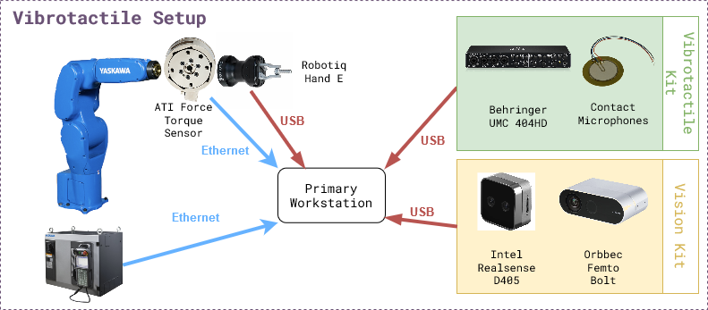

# Vibrotactile System - Installation


```{contents}
```

## Hardware 

The figure below shows the experiment setup. The list of hardware components can be found below as well as in the [BOM sheet](https://docs.google.com/spreadsheets/d/1p2As_AB7A4FWpQJU8ZtA_rXWKELAA8dq/edit?usp=sharing&ouid=112281614924032477147&rtpof=true&sd=true).


### Mandatory
| Name | Suggested Order Link | Quantity | Price | Total Cost|
|-------|-------------|-------------|-------------|-------------|
| Behringer UMC 404HD | [B&H Photo Video](https://www.bhphotovideo.com/c/product/1821221-REG/behringer_umc404hd_audiophile_4x4_24_bit_192_khz.html?ap=y&smp=Y) | 1 | $109.00 | $109.00 |
| 5 Pack of Piezoelectric Contact Microphones | [Amazon](https://www.amazon.com/TIMESETL-Microphone-Self-Adhesive-Instrument-Mandolin/dp/B07ZTBVKRD/ref=sr_1_5?crid=1OHNBI7Y4OM4U&dib=eyJ2IjoiMSJ9.-PibDNlinRz79bIpdumGJHAAdW3PdumsNrUWTrBZB4hYry4WdTr78zPfu4ZnYQWFlwNLi0yY8THnebiukewvbaDljZXfaSdQ0njt5TC4QlHQUbw-4_M51b1tVUYlgZl6bLj9okH0wZqaFYOOhAo4upt3WI4d1Tj6ApClqPZNZep-iIMk3dItQ0ypgfMbxqWdPuSmfoJVkW-mXZQSGQE25jBOfYMTwTv_7UsH_2RJuBoABTUdnXDijXNkBa1PxqxMXAsXIjy9HopNVacSJfhPereGmHMmK3gLGBOpPmN7eJc.JVs0GaesD3pa5oN6mlhvDtEM4Jdsj8TEvta9yf8iEBU&dib_tag=se&keywords=contact+microphone&qid=1728404098&sprefix=contact+microphone%2Caps%2C116&sr=8-5) | 1 | $14.99 | $14.99 |
| Cable Matters 2-Pack 1/4 Inch Cable 6 Feet | [Amazon](https://www.amazon.com/Cable-Matters-2-Pack-Straight-Instrument/dp/B073RMQKYG/ref=sr_1_5?crid=3CAXQV30GAW34&dib=eyJ2IjoiMSJ9.Kt4WgCJJxKgRCeq0DAJKS-hNN4erYY2vaNujsRJ79_VO1tDk5Lk_iwploE1cLZ84vf7-BUaTykY2GWsQ-ok3Cxo31LQ-_hUiD-dSBHQGE66CwqGDRkAYst0p9N8vxKShFFfwDUwgWAv5Zr7fwUBfH6WKmorjgqEohj5LpuAUZSFXZHCbsmui-RZapHChPC0qWVZIvvXxeVhLABGOOtuXiKXuITo_nMy1gSxIlrr5y5yHl3O_oRLR_WkkS9XHgQiJUMZWROeesGbWotCmyGCRZQ21p-_ISN1SPshgiikzoZc.UjQgkGwOghuAMmPTfaykA48QvzMRfXTSK0Cc3Xy4KKg&dib_tag=se&keywords=1%2F4%2Bto%2B1%2F4%2Baudio%2Bcable&qid=1728404189&sprefix=1%2F4%2Bto%2B1%2F4%2Baudio%2Bcabl%2Caps%2C112&sr=8-5&th=1) | 2 | $9.99 | $18.98 | 
| 5952 VHB Tape: 2.5cm x 15 ft | [Amazon](https://www.amazon.com/3M-Scotch-5952-VHB-Tape/dp/B01BU7038A/ref=sr_1_5?crid=3H9RB26LUQG7O&dib=eyJ2IjoiMSJ9.Ij13Xm94FJr9PZn3aLfDPpOQpL0kG5guXpqFnrtxxApBgO0D4_uru2Ya49socXCKt5_lS1IyyK-f2AFkj_JdW1nJqTNxcJqE6c0EUpz9_DOc1_U379iAkGnTiFRQaadsdrcnWBLYHFkT-ZXK5OC1fCDohgApHC7BwbDJ-ecp2gXJpj-4Ydpq2VgP8zKaCT-Ue_GTKiRmtjZBTlUEcu3XDjyv7lHTFG1vEs_tZeiESQg.eMBWUCijaoBW8H9EShv5IFQmyg74ExMHGe5X_Q8d4eU&dib_tag=se&keywords=VHB+tape&qid=1710778116&sprefix=vhb+tape%2Caps%2C92&sr=8-5#customerReviews) | 1 | $13.99 | $13.99 |
| ATI Gamma Net Type SI-32-2.5 | [ATI](https://www.ati-ia.com/products/ft/ft_models.aspx?id=Gamma) | 1 | ~$6000 | ~$6000 |

### Optional
| Name | Suggested Order Link | Quantity | Price | Total Cost|
|-------|-------------|-------------|-------------|-------------|
| Intel Realsense D405 | [Intel](https://store.intelrealsense.com/buy-intel-realsense-depth-camera-d405.html) | 1 | $272.00 | $272.00 |
| Orbbec Femto Bolt | [Orbbec](https://store.orbbec.com/products/femto-bolt) | 1 | $418 | $418 |
| Amazon Basics USB-A 3.0 Extension Cable, 3 Meters | [Amazon](https://www.amazon.com/dp/B00NH12O5I?th=1) | 2 | $8.54 | $17.08 | 


## Software

There are two levels of software installation required for the vibrotactile system.

Relevant repositories:\
<a href="https://github.com/cmu-mfi/motoman_ros1" class="inline-button"><i class="fab fa-github"></i>motoman_ros1</a>
<a href="https://github.com/cmu-mfi/vibro_tactile_toolbox" class="inline-button"><i class="fab fa-github"></i>vibro_tactile_toolbox</a>

**1. Device Interfaces**\
This includes the installation of the software required to interface with the hardware components like robots, cameras, grippers, etc.

ROS Nodes for the devices can be launched using docker-compose.yml in `docker/` directory. It will need modification if using other hardware, like different cameras.

**2. Vibrotactile System**\
This includes the installation of the software required to run the vibrotactile system which involves teach, learn and execute tasks described in the [overview](Vibrotactile.md) section.

### Installation Steps

1. **Step 1: Device Interfaces**
    - Make sure the devices are connected and working properly.
    - Make sure you connect a monitor to the computer that is connected to the UMC404HD Audio Interface and log into Ubuntu once before following the instructions below.
    - Pre-requisite for the vibrotactile system is one robot arm, 2-4 contact microphones, one force torque sensor, one side camera and one gripper.
    - Software pre-requisites: [Docker](https://docs.docker.com/get-docker/), [Docker Compose](https://docs.docker.com/compose/install/), [NVIDIA Container Toolkit](https://docs.nvidia.com/datacenter/cloud-native/container-toolkit/install-guide.html#docker)
    - Make sure the motoman ros1 docker is working with a robot namespace.
    - Make sure the force torque sensor is publishing on the `/<robot namespace>/fts` topic.
    - First decide where to install the vibro_tactile_toolbox.
        ```shell
        cd /path/to/desired/folder
        git clone https://github.com/cmu-mfi/vibro_tactile_toolbox.git 
        cd vibro_tactile_toolbox/docker
        ```
    - Next you will need to modify `vibro_tactile_toolbox/docker/vibrotactile.env`
        ```shell
        ROS_MASTER_URI=http://<your computer ip>:11311
        ROS_IP=<your computer ip>
        NAMESPACE=<robot namespace>
        TYPE=NIST
        DATA_DIR=/path/to/desired/data/directory
        PROJ_DIR=/path/to/desired/folder/vibro_tactile_toolbox/
        ROBOT_IP=<your robot ip>
        ```
    - Add environment variables to `~/.bashrc` file.
        ```shell
        cd vibro_tactile_toolbox/docker
        echo source $(pwd)/vibrotactile.env >> ~/.bashrc
        source ~/.bashrc
        ```
    - Afterwards you will build the dockers following the below commands:
        ```shell
        bash build_docker.sh
        docker compose up --build -d
        ```
    > Note: If using different hardware, modify the `docker-compose.yml` file accordingly.
<br>

2. **Step 2: Systems Check**

    - Run system check test
        ```
        bash $PROJ_DIR/convenience_scripts/systems_check.sh
        ```

3. **Step 3: Modify/Create Config Files**

    - You can look through and modify the config files in the config folder such as `nist.yaml` and `lego.yaml`. 
    - Also if your end effector to robot transformation is different, you will need to modify the file `transforms/hande_ee.tf` or `transforms/lego_ee.tf` to account for the differences.
    - You will need to adjust the side camera view according to how you mounted the camera. To do so, you need to follow these steps:
    1. Open a new terminal and run the following steps:
        ```
        xhost +
        bash $PROJ_DIR/docker/new_terminal.sh
        rosrun vibro_tactile_toolbox determine_camera_parameters.py $NAMESPACE 
        ```
    2. Next click on the Rotate button on the top left of the window named RAW IMAGE until the image is correctly rotated to be upright.
    Then click on the location of the connector socket that will be used in the data collection. Check the image in the CROPPED IMAGE window. Once you are happy with the view, then press 'q' on the keyboard. The terminal will print out the correct camera parameters that you will need to copy into the `launch/orbbec.launch` in the vibro_tactile_toolbox folder. In particular, you will need to modify the `rotation`, `x_offset` and `y_offset` parameters.
    Then you will need to save the file and run the following commands to restart the docker containers.
        ```shell
        cd $PROJ_DIR/docker
        docker compose down
        docker compose up --build -d
        ```

4. **Step 4: TEACH - Collect training data**
    1. NIST Connectors
    - The first step to teach a new connector is to place the connector at a consistent and repeatable location such as a corner. For this tutorial, I will be pretending to use an ethernet cable, but you can subsitute the word `ethernet` with whichever connector you would like.
    - Next, you will need to open the robot's gripper if you are using the Robotiq Hand E.
    - If the vibro_tactile_toolbox_container is already running, you can just create a new terminal using the command:
        ```
        bash $PROJ_DIR/docker/new_terminal.sh
        ```
    - To open the Robotiq Hand E gripper, you need to run the following command in the docker container.
        ```
        rosrun robotiq_mm_ros open_gripper.py $NAMESPACE
        ```
    - Then you will jog the robot so that when it closes it's fingers, it can perfectly pick up the connector. You can test the position by opening and closing the gripper and seeing if the connector moves from the original position.
        ```
        rosrun robotiq_mm_ros close_gripper.py $NAMESPACE
        rosrun robotiq_mm_ros open_gripper.py $NAMESPACE
        ```
    - After you are satisfied with the robot pose, you will need to run the `save_hande_pose` launch file to save the current robot pose.
        ```
        roslaunch vibro_tactile_toolbox save_hande_pose.launch namespace:=$NAMESPACE proj_dir:=$PROJ_DIR
        ```
    - The resulting saved pose will be located in the `$PROJ_DIR/transforms/` folder in the file `hande_world.tf`. You can get there in a new terminal using the following command.
         ```
        cd $PROJ_DIR/transforms
        ```
    - Next you will need to create a new folder in transforms that represents the name of the connector such as ethernet.
        ```
        mkdir ethernet
        ```
    - Afterwards, move the saved transform in and name it `world_pick.tf`
        ```
        cd $PROJ_DIR/transforms
        mv hande_world.tf ethernet/world_pick.tf
        ```
    - Now you will need to close the robot's gripper and then jog the robot to the designated place pose where the connector in the Robotiq gripper is fully inserted into the receptacle. Again you will run the `save_hande_pose.launch` file inside the docker container.
        ```
        rosrun robotiq_mm_ros close_gripper.py $NAMESPACE
        # JOG robot to placement pose
        roslaunch vibro_tactile_toolbox save_hande_pose.launch namespace:=$NAMESPACE proj_dir:=$PROJ_DIR
        ```
    - Then you will again move the `hande_world.tf` pose file to the `ethernet` folder.
        ```
        cd $PROJ_DIR/transforms
        mv hande_world.tf ethernet/world_place.tf
        ```
    - Next step, you can take a look at the launch file `collect_nist_audio_data.launch` inside of `$PROJ_DIR/launch` and make any desired modifications such as the number of trials to collect.
    - Afterwards, you will restart all the docker containers using the following commands:
        ```
        cd $PROJ_DIR/docker
        docker compose down
        docker compose up --build -d
        ```
    - Then once the docker containers have started, run the check again:
        ```
        bash $PROJ_DIR/convenience_scripts/systems_check.sh
        ```
    - Finally to start the data collection, you will run:
        ```
        bash $PROJ_DIR/docker/new_terminal.sh
        # OPEN THE GRIPPER
        rosrun robotiq_mm_ros open_gripper.py $NAMESPACE
        # MOVE THE CONNECTOR TO ITS RESET POSE
        roslaunch vibro_tactile_toolbox collect_nist_audio_data.launch namespace:=$NAMESPACE data_dir:=$DATA_DIR proj_dir:=$PROJ_DIR connector_type:=ethernet
        ```
    - Keep an eye on the robot and hold onto the connector when the robot releases it.
    2. LEGO
    - For the lego task, we will be assuming that the lego board is fixed. You will need to register multiple positions on the board within a region. 
    - First you will need to download my trained lego detector model from [here](https://drive.google.com/file/d/1SGcNrUVqfxy641kZhhMAM2H9WvDHTupR/view?usp=drive_link). Then you will move it into a models folder in vibro_tactile_toolbox.
        ```
        cd $PROJ_DIR
        mkdir models
        mv ~/Downloads/lego_model.pth models/
        ```
    - Next you will need to make sure the docker containers are closed with `docker compose down` in the `$PROJ_DIR/docker` folder and edit the `vibrotactile.env` file in the `docker` folder so that `TYPE=lego` instead of `TYPE=nist`. 
    - Next you will need to remove all of the previously taught locations in the `$PROJ_DIR/transforms/T_lego_world/` folder using the following command:
        ```
        rm -rf $PROJ_DIR/transforms/T_lego_world/*
        ```
    - Then you can start the docker containers again:
        ```shell
        cd $PROJ_DIR/docker
        docker compose up --build -d
        ```
    - To register a lego pose, use the teach pendant to jog the robot so that it is pushing a 2x1 lego block down onto the lego board. Figure out the peg's x,y location by using the top left peg of the board as 0,0 and decreasing x towards the robot and increasing the y location from left to right. Use the following command to save the lego pose:
        ```
        bash $PROJ_DIR/docker/new_terminal.sh
        roslaunch vibro_tactile_toolbox save_lego_pose.launch namespace:=<robot namespace> proj_dir:=$PROJ_DIR x:=<current x position> y:=<current y position>
        ```
    - The lego pose will then be saved in the folder `$PROJ_DIR/transforms/T_lego_world/` with the file name `lego_world_<current x position>_<current_y_position>.tf`.
    - Next, you can take a look at the launch file `collect_lego_audio_data.launch` inside of `$PROJ_DIR/launch` and make any desired modifications such as the number of trials to collect.
    - Afterwards, it is very important to restart the docker contains using the following commands: 
        ```
        cd $PROJ_DIR/docker
        docker compose down
        docker compose up --build -d
        ```
    - Then once the docker containers have started, run the check again:
        ```
        bash $PROJ_DIR/convenience_scripts/systems_check.sh
        ```
    - Finally to start the data collection, you will run:
        ```
        bash $PROJ_DIR/docker/new_terminal.sh
        roslaunch vibro_tactile_toolbox collect_lego_audio_data.launch namespace:=$NAMESPACE data_dir:=$DATA_DIR proj_dir:=$PROJ_DIR block_type:=<your current block type>
        ```
    - Keep an eye on the robot and stop the data collection script if the lego flies off the board. If the lego vision predictions are incorrect, you will need to adjust the top_bbox and bot_bbox in the `lego_detector` in `config/lego.yaml`.

5. **Step 5: LEARN - Train the models**
    - If you want to download sample data, you can download them [here](https://drive.google.com/drive/folders/1_JnpDF9Mceyzx34Hz1qKBsjdGAOaGSJM?usp=drive_link) and unzip them into your Documents/vibro_tactile_data folder.
    1. NIST Connectors
        - To create the NIST dataset, you will need to modify the script in `convenience_scripts/make_nist_dataset.sh`.
        - Basically VOLS represents the volumes you have collected data at. CONNECTORS represents the connectors that you have collected data with. If you only collected `ethernet` you would only have "ethernet" in the (). VELS represents the velocities that you have collected data at. TRAIN_VS_TEST represents whether you have collected test data yet or not. If you haven't you would just have "vel_" in there. Finally ROBOT_NAME is the robot's namespace. For example, you could modify it to be:
        ```
        VOLS=(75)
        CONNECTORS=("ethernet")
        VELS=(0.01)
        TRAIN_VS_TEST=("vel_")
        ROBOT_NAME="<robot namespace>"
        ```
    2. LEGO
        - To create the Lego dataset, you will need to modify the script in `convenience_scripts/make_lego_dataset.sh`.
        - Basically VOLS represents the volumes you have collected data at. BRICKS represents the brick types that you have collected data with. If you only collected `2x1` you would only have "2x1" in the (). VELS represents the velocities that you have collected data at. TRAIN_VS_TEST represents whether you have collected test data yet or not. If you haven't you would just have "vel_" in there. Finally ROBOT_NAME is the robot's namespace. For example, you could modify it to be:
        ```
        VOLS=(75)
        BRICKS=("2x1") 
        VELS=(0.01)
        TRAIN_VS_TEST=("vel_")
        ROBOT_NAME="<robot namespace>"
        ```
    3. Training the outcome and terminator models
        - To train the audio outcome and terminator models, you will need to modify the script in `convenience_scripts/train_outcome_and_terminator_models.sh` and `convenience_scripts/test_trained_outcome_and_terminator_models.sh`. 
        - Basically TYPES represents the type of connector you have collected data with and CHANNELS represents the audio channels you want to use. For example, training all of the audio channels for ethernet would result in:
        ```
        TYPES=("ethernet")
        CHANNELS=("0,1,2,3")
        ```
        - On the other hand training all of the audio channels for lego would result in:
        ```
        TYPES=("lego")
        CHANNELS=("0,1,2,3")
        ```
    4. After you have made the changes to the `convenience_scripts", you will need to again run:
        ```
        cd $PROJ_DIR/docker
        docker compose up --build -d
        ```
        - Then once the dockers have been built, you will run:
        ```
        bash $PROJ_DIR/docker/new_terminal.sh
        bash $PROJ_DIR/convenience_scripts/make_nist_dataset.sh
        bash $PROJ_DIR/convenience_scripts/train_outcome_and_terminator_models.sh
        ```

6. **Step 6: EXECUTE - Validate the system**
    1. To download already pretrained models, you can download them [here](https://drive.google.com/drive/folders/1QPUI7IPVllI9K_c3E34HhZLIIfjEob0-?usp=drive_link) and extract them into the `$PROJ_DIR/models` folder.
    2. Next you will need to take a look at the `test_nist_audio_outcome.launch` and `test_lego_audio_outcome.launch` files and make changes depending on your preferences.
    3. Finally you will need to start the docker container using the following command for ethernet:
        ```
        cd $PROJ_DIR/docker
        docker compose up --build
        ```
    4. Finally to start the nist evaluation, you will run:
        ```
        roslaunch vibro_tactile_toolbox test_nist_audio_outcome.launch namespace:=$NAMESPACE proj_dir:=$PROJ_DIR data_dir:=$DATA_DIR connector_type:=ethernet
        ```
    5. For lego you will instead run:
        ```
        cd $PROJ_DIR/docker
        docker compose up --build
        ```
        and
        ```
        roslaunch vibro_tactile_toolbox test_lego_audio_outcome.launch namespace:=$NAMESPACE proj_dir:=$PROJ_DIR data_dir:=$DATA_DIR block_type:=<your current block type>
        ```