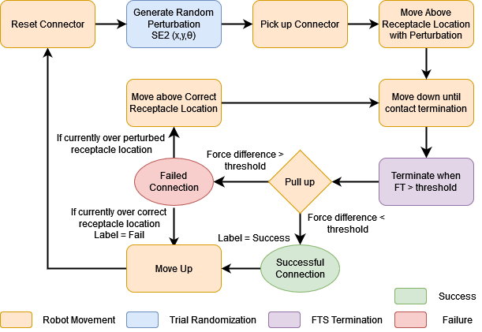
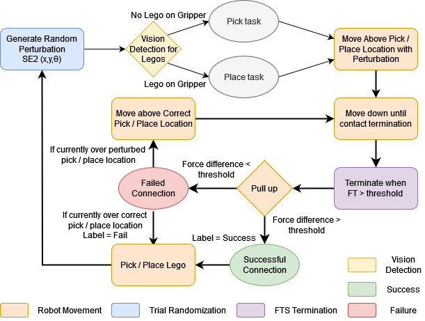

# Vibrotactile System - Overview

In this thrust, we explore the use of vibrotactile data for monitoring manufacturing assembly processes to determine when an assembly step is complete or an error has occurred. We establish a set of procedures for collecting vibrotactile data. We also develop a set of data-driven methods for estimating task outcomes, terminating skills early, and selecting robust execution parameters. These learned models increase the reliability of the assembly skills while relying largely on self-supervised learning methods. Given their contact-rich nature, we focus on monitoring insertion tasks, such as fastener and connector insertion, with mainly rigid components at a centimeter scale. We explore learning across different materials and sizes of components.


```{contents}
```
---
## TEACH: Data Collection

### NIST Data Collection



<iframe width="560" height="315" src="https://www.youtube.com/embed/iAEQY6bjOss?si=rLmF_a6JPDQohMNW" title="YouTube video player" frameborder="0" allow="accelerometer; autoplay; clipboard-write; encrypted-media; gyroscope; picture-in-picture; web-share" referrerpolicy="strict-origin-when-cross-origin" allowfullscreen></iframe>

### LEGO Data Collection



<iframe width="560" height="315" src="https://www.youtube.com/embed/-Z85p3ztPq4?si=kySVBApxR_s5e8tO" title="YouTube video player" frameborder="0" allow="accelerometer; autoplay; clipboard-write; encrypted-media; gyroscope; picture-in-picture; web-share" referrerpolicy="strict-origin-when-cross-origin" allowfullscreen></iframe>

---
## LEARN: Model Training

For the vibrotactile pick/place skills, models are required for following:

| Skill | Data Inputs |
|-------|-------------|
|audio-based outcome detection| audio spectogram images (1s) |
|audio-based termination | audio spectogram images (0.1s) |

---
## EXECUTE: Model Inference

