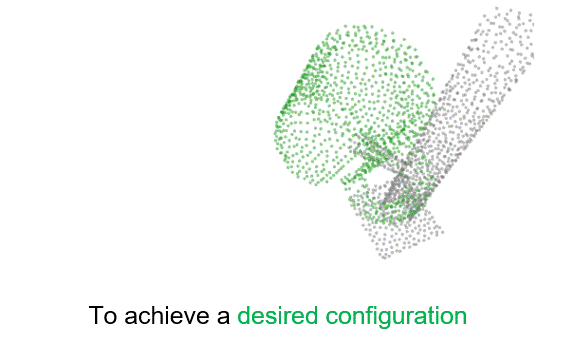
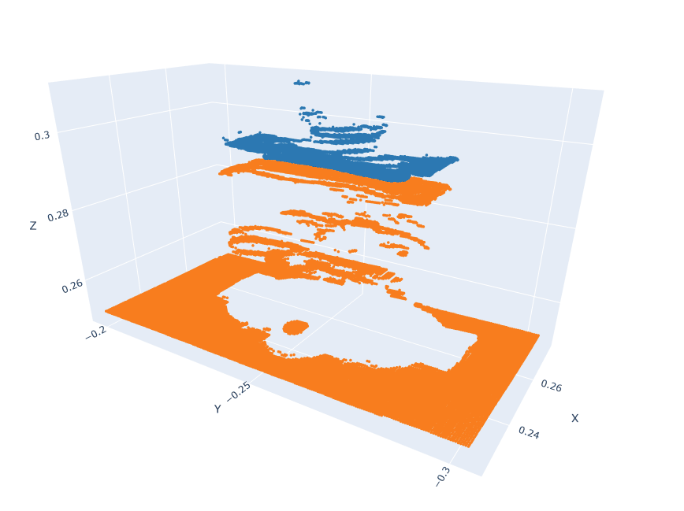
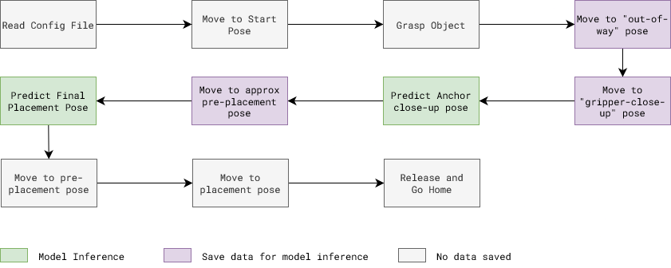

# Vision

Vision skills teach robots how to transform arbitrary objects into target poses. We develop a pre-trained model for performing a wide variety of such tasks; this model
can later be fine-tuned on data for a particular task of interest.

The tasks involve placing one object (which we call the “action” object) at a semantically meaningful location relative to another object (which we call the “anchor” object)


```{contents}
```

```{toctree}
:maxdepth: 2
:hidden:

Vision/Tutorial.md
Vision/Installation.md

```

```{eval-rst}
.. hidden::
## TEACH: Data Collection
```
The data collection procedure involves manually jogging the robot to do an assembly/disassembly task during which camera and robot data is recorded. 

It is assumed that the system setup (like, camera calibration) is done before data collection procedure. 


*Data collection procedure for an insertion placement task*

## LEARN: Model Training

A trained model is used for estimating corss-pose between action and achor pointclouds. Details for the model can be found here: [TAX-Pose Paper](https://arxiv.org/pdf/2211.09325)



Data input for training: 

> *Action pointclouds at the target position inserted in the Anchor pointcloud*

| Waterproof Connector | D-Sub Connector |
|----------------------| ----------------|
|  |  |
|  |  |

## EXECUTE: Model Inference

Execution is similar to the data collection process, except robot move autonomously using saved poses from earlier and uses trained model to infer right target pose for action object.

Here is a flow diagram of execution steps involved for insertion placement task:
