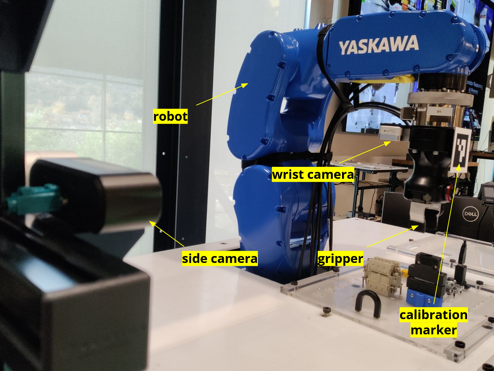
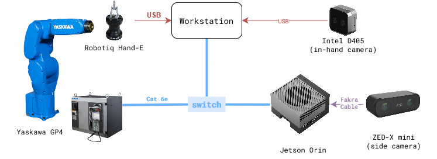

# Vision System - Installation



```{contents}
```

## Hardware 

Figure below shows the experiment setup during the project period. The list of hardware components can be found here in the [BOM sheet](https://docs.google.com/spreadsheets/d/1p2As_AB7A4FWpQJU8ZtA_rXWKELAA8dq/edit?usp=sharing&ouid=112281614924032477147&rtpof=true&sd=true)



> Note: Bolt pattern of GP4 end effector and Robotiq HandE is different. So, a custom adapter plate will be needed to mount the Robotiq HandE on GP4.

## Software

There are two levels of software installation required for the vision system.

**1. Device Interfaces**\
This includes the installation of the software required to interface with the hardware components like robots, cameras, grippers, etc.

Relevant repositories:\
<a href="https://github.com/cmu-mfi/motoman_ros1" class="inline-button"><i class="fab fa-github"></i>motoman_ros1</a>
<a href="https://github.com/stereolabs/zed-ros-wrapper" class="inline-button"><i class="fab fa-github"></i>zed-ros-wrapper</a>
<a href="https://github.com/cmu-mfi/realsense-ros1-docker" class="inline-button"><i class="fab fa-github"></i>realsense-ros1-docker</a>
<a href="https://github.com/cmu-mfi/rosbridge_suite" class="inline-button"><i class="fab fa-github"></i>rosbridge_suite</a>

**2. Vision System**\
This includes the installation of the software required to run the vision system which involves teach, learn and execute tasks described in the [overview](Vision.md) section.

Relevant repository:\
<a href="https://github.com/cmu-mfi/rtc_vision_toolbox" class="inline-button"><i class="fab fa-github"></i>rtc_vision_toolbox</a>


## Installation Steps

1. **Step 1: Device Interfaces**:
    - Follow the installation instructions in the respective repositories.
    - Make sure the devices are connected and working properly.

2. **Step 2: Check Camera positions**:
    - ...

3. **Step 3: Device Setup: Camera-Robot Calibration**:
    - ...

4. **Step 4: Create Config Files**:
    - ...

5. **Step 5: TEACH - Collect training data**:
    - ...

6. **Step 6: LEARN - Train the model**:
    - ...

7. **Step 7: EXECUTE - Run the vision system**:
    - ...

8. **Step 8: Validate and Retrain**:
    - ...
    - ...
    - Repeat 4-5-6 steps as needed.
    
