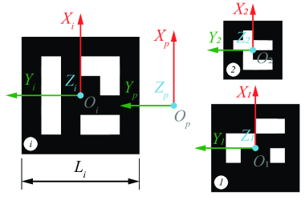

# Robot-Camera Calibration 

There are two types of robot-camera calibration:
* **eye-on-hand**: camera is mounted on the robot
* **eye-on-base**: camera is mounted on a fixed base

## Method: eye-on-hand


| Known Value(s) | Collected Samples | Unknown Value(s) |
| --- | --- | --- |
| {math}`^gT_m` | {math}`^bT_g^{(i)}, ^cT_m^{(i)}` | {math}`^bT_c` |

Given a setup of camera on fixed base, the procedure to calibrate the robot-camera system is as follows:

1. Mount a marker on the robot end effector.
2. Estimate {math}`^gT_m`, the transformation matrix marker to gripper. \ 
    This value is determined from CAD reference *(preferred)* or measuring the marker center from end effector frame. If using ArUco marker, the marker center is the origin of the marker frame.
<!--  -->
<center></center>

3. Collect samples of {math}`^bT_g^{(i)}` and {math}`^cT_m^{(i)}`. \
    Each sample is collected by moving the robot to a new pose and capturing the image of the marker. The pose of the marker in the image is used to estimate {math}`^cT_m^{(i)}`. The pose of the robot end effector is used to estimate {math}`^bT_g^{(i)}`.
4. Estimate {math}`^bT_c`, the transformation matrix base to camera using suitable algorithm as discussed in [section below](#calibration-algorithms). \

## Method: eye-on-base

... to be updated

## Code Overview

code overview

## Calibration Algorithms

- **One Sample Estimate**  
  Calculate the following for each sample, and select the one with the best average reprojection error for the set.

```{math}
    ^bT_c^{(i)} = ^bT_g^{(i)} \cdot ^gT_m \cdot (^cT_m^{(i)})^{-1}
```

- **Kabsch-Umeyama algorithm**  
  The algorithm calculates the optimal rotation matrix that minimizes the root mean squared deviation between two paired sets of points [\[1\]](#references).

- **OpenCV Approach 1: Rotation then Translation**  
  In this approach, OpenCV provides the following methods to first estimate the rotation and then the translation (separable solutions):
  - R. Tsai, R. Lenz: *A New Technique for Fully Autonomous and Efficient 3D Robotics Hand/Eye Calibration* [\[2\]](#references)
  - F. Park, B. Martin: *Robot Sensor Calibration: Solving AX = XB on the Euclidean Group* [\[3\]](#references)
  - R. Horaud, F. Dornaika: *Hand-Eye Calibration* [\[4\]](#references)

- **OpenCV Approach 2: Simultaneous rotation and translation**  
  Another approach consists of estimating simultaneously the rotation and the translation (simultaneous solutions), with the following implemented methods:
  - N. Andreff, R. Horaud, B. Espiau: *On-line Hand-Eye Calibration* [\[5\]](#references)
  - K. Daniilidis: *Hand-Eye Calibration Using Dual Quaternions* [\[6\]](#references)

#### References
1. Lawrence, 2019. Purely Kabsch-Umeyama Algorithm.
2. Tsai, R., Lenz, R., 1989. A New Technique for Fully Autonomous and Efficient 3D Robotics Hand/Eye Calibration.
3. Park, F., Martin, B., 1994. Robot Sensor Calibration: Solving AX = XB on the Euclidean Group.
4. Horaud, R., Dornaika, F., 1995. Hand-Eye Calibration.
5. Andreff, N., Horaud, R., Espiau, B., 1999. On-line Hand-Eye Calibration.
6. Daniilidis, K., 1999. Hand-Eye Calibration Using Dual Quaternions.