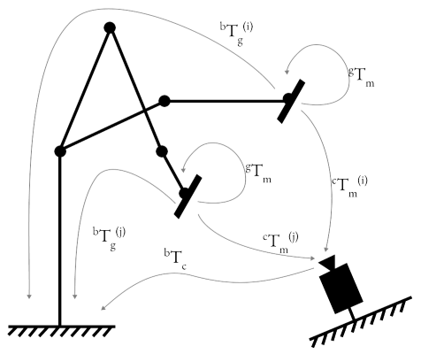

# Robot-Camera Calibration 

There are two types of robot-camera calibration:
* **eye-on-hand**: camera is mounted on the robot
* **eye-on-base**: camera is mounted on a fixed base

## Method: eye-on-hand

| Known Value(s) | Collected Samples | Unknown Value(s) |
| --- | --- | --- |
| $^gT_m$ | $^bT_g^{(i)}, ^cT_m^{(i)}$ | $^bT_c$ |

Given a setup of camera on fixed base, the procedure to calibrate the robot-camera system is as follows:

1. Mount a marker on the robot end effector.
2. Estimate $^gT_m$, the transformation matrix maker to gripper. Determine this value from CAD reference     *(preferred)* or measuring the marker center from end effector frame. If using ArUco marker, the marker center is the origin of the marker frame.

<!--  -->

3. 

## Method: eye-on-base

## Code Overview

code overview

* 