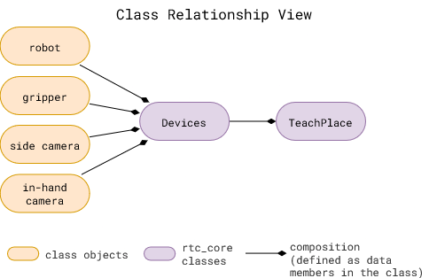
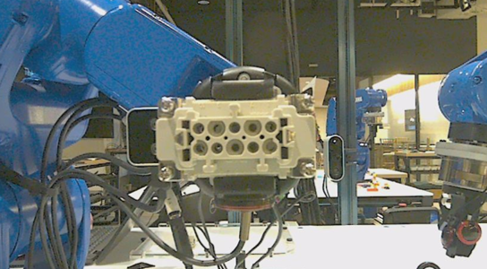
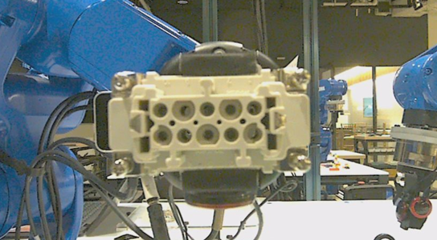
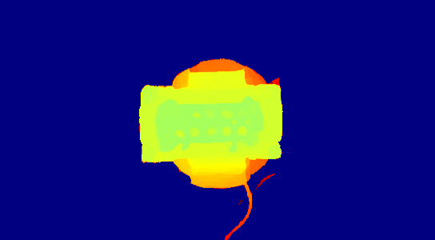
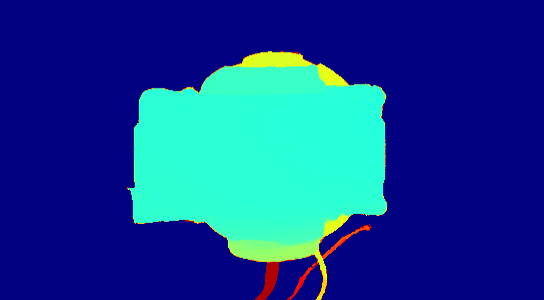
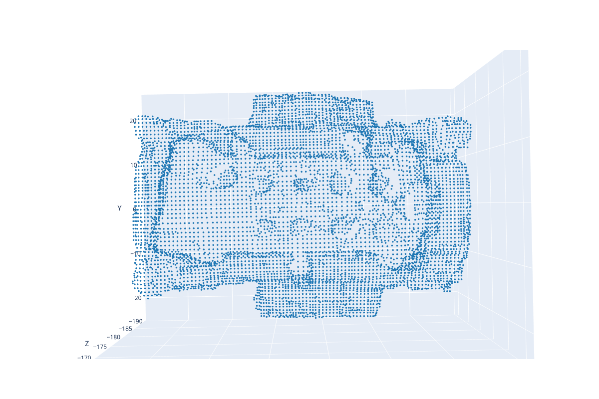
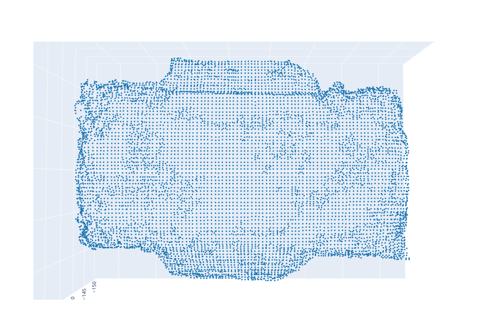

# TEACH - Collecting Data

```{contents}
```

## Method

The data collection procedure involves manually jogging the robot to do an assembly/disassembly task during which camera and robot data is recorded. 

It is assumed that the system setup (like, camera calibration) is done before data collection procedure. 

(data-collection)=

*<center>Data collection procedure for an insertion placement task</center>*

<!-- <iframe width="704" height="396" src="https://www.youtube.com/embed/yKXflZ4BOYs" title="Vision Based Insertion - Training Procedure" frameborder="0" allow="accelerometer; autoplay; clipboard-write; encrypted-media; gyroscope; picture-in-picture; web-share" allowfullscreen></iframe>  -->

## Code Overview

<a href="https://github.com/cmu-mfi/rtc_vision_toolbox" class="inline-button"><i class="fab fa-github"></i>rtc_vision_toolbox</a>



* rtc_core classes: These are defined in the rtc_core folder
* `Devices` class is used to define the devices used in the system. It is used to define the camera and robot used in the system. It uses a config file to intialize the required device classes.
* `TeachPlace` class is used to define the data collection procedure for an insertion task. It uses the `Devices` class to initialize the camera and robot.

All the blocks in [data collection procedure](data-collection) are implemented in the `TeachPlace` class in `rtc_core/place_skill/teach_place.py`.

Refer `scripts/place_teach.py` to see how to use the `TeachPlace` class to collect data.

## Useful Tips

- **Configuration file is important**
    - All the parameters are defined in one `.yaml` file. `demo-example/demonstrations/08-14-wp/place_object.yaml` is an example of a configuration file.
    - It includes devices to initialize, the task to perform, and the data collection procedure.

- **Configuration Parameters**
    - Variation parameters should be representative of deployment conditions. Parameters to keep in mind:
        - `num_demos`
        - `training.test_ratio`
        - `training.action.view_variations`/`training.action.pose_variations`: Use 1 for no variation *(recommended)*. Use a higher number for more variation, if the system needs to be more reliable.
        - Varying Initial Gripper Pose at every demo cycle. 
          Make sure to vary the gripper pose as much as you expect in the deployment scenario. If you expect, for example, the action object to be held +/- 5deg, then make sure to vary the gripper pose by at least that much in the data collection procedure.

- **Data Quality**
    - Parameters in the configuration file should be set to ensure good data quality:
        - `training.action.viewing_distance` and `training.anchor.viewing_distance` \
            Different cameras have different focal lengths. The distance from the camera should be set to ensure the object is in focus.
        - `training.action.view_variations` and `training.anchor.view_variations` \
            Aggresive variations can lead to object occlusion, which can lead to bad data samples.
        - `devices.cameras.<camera name>.setup` \
            Calibration matrix for each camera is important that it is correct. It is used to pose the object in the camera frame.
    - Monitor images saved during data collection to ensure the quality of data. [Table](table-good-bad) below shows good and bad data samples. 
        - It can be seen from the bad depth image that the features of the connector are not captured, which is evident in the point too. In this case, the difference is the distance from the camera. The object is too close to the camera in the bad image.

    (table-good-bad)=
    | Good | Bad |
    |---------|---------|
    |  |  |
    |  |  |
    |  |  |


## Try it out

<insert gazebo sim>