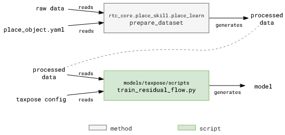

# LEARN - Training a model

```{contents}
```

## Method

A trained model is used for estimating corss-pose between action and achor pointclouds. Details for the model can be found here: [TAX-Pose Paper](https://arxiv.org/pdf/2211.09325)


## Code Overview

<a href="https://github.com/cmu-mfi/rtc_vision_toolbox" class="inline-button"><i class="fab fa-github"></i>rtc_vision_toolbox</a>



* There are two steps involved in training a model, which is represented in the above image: **preparing the dataset**, and **training the model**.
<br><br>

### Configuration Files
1. Prepare Dataset:
    * [Sample config file](https://github.com/cmu-mfi/rtc_vision_toolbox/blob/2e8f252589e442153d5d982172b98cc352207988/demo-example/demonstrations/08-14-wp/place_object.yaml)
    * Same configuration file  as the one used for collecting data.
    * Key parameters:
        * `devices.cameras.<camera name>.setup`: Camera calibrations are important to transform action object and anchor object pointclouds correctly.
        * `training.action.object_bounds` `training.anchor.object_bounds`: The bounding box is used to crop the pointcloud to the object of interest.

2. Train Model:
    * [Sample config file](https://github.com/cmu-mfi/taxpose/blob/d65796b06c85e62295f890ec7ae1f9289f6d25b6/configs/commands/mfi/waterproof/train_taxpose_08-14-wp_place.yaml)    
    * The configuration for training is defined under [taxpose](https://github.com/cmu-mfi/taxpose/tree/d65796b06c85e62295f890ec7ae1f9289f6d25b6/configs) repo.
    * If defining a new task and/or a new setup, each folder in the `config` directory should have respective object/task/scene definition.
    * The `train_residual_flow.py` uses [hydra](https://hydra.cc/) to resolve the configuration files.
    * Primary configuration file is under `configs/commands` directory that is linked above in first bullet.
    * Key parameters:
        * `dataset_root`: Path to the train/test prepared dataset.
        * `min_num_points`: Action and anchor pointclouds are downsampled to this number of points. Higher number of points will improve the accuracy but will increase the training time. So if the connectors have intricate features, it is better to keep this number high. Otherwise, a lower number of points will suffice. Reduce the number if you get error about points being lesser than the minimum number of points.
        * `batch_size`: Number of samples in each batch. Higher number will increase the training time and memory requirements but will improve the accuracy. Batch size 8 with 2048 min_num_points required 20GB of GPU memory. So, if you have a smaller GPU, reduce the batch size.
        * `max_epochs`: Number of epochs to train the model. 4000 epochs are more than enough to train the model. The model usually converges within 1000 epochs. More epochs, more training time.
        * `wandb.entity`: Enter your wandb username. If you don't want to use wandb (*not recommended*), set WANDB_MODE=disabled before running the script.


*Note: We want to integrate training routine in `rtc_core.place_skill.place_learn.learn` method. This will allow the user to train the model using same script, and configure the training parameters in one configuration file. Contributions are welcome.*

## Try it out

*...todo...*