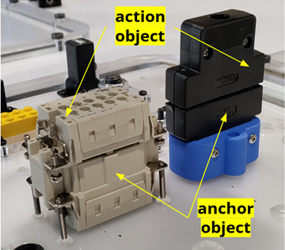
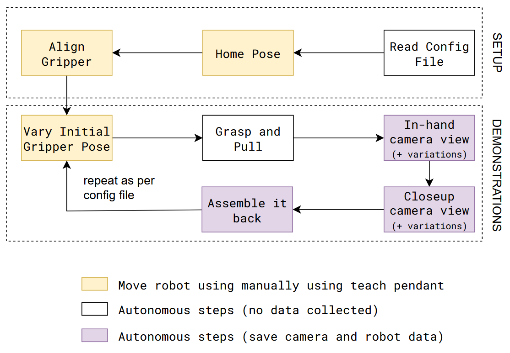
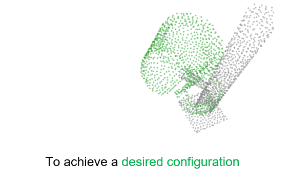
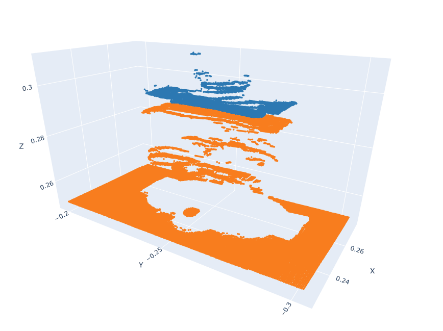
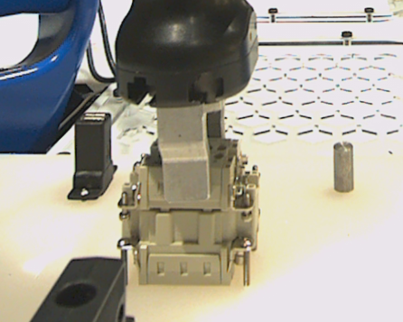
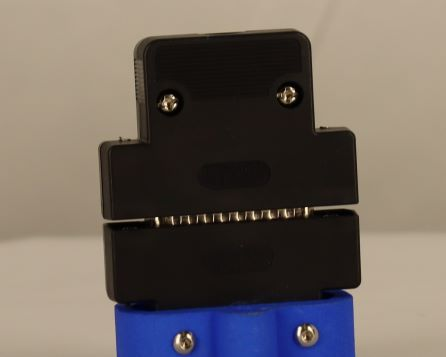

# Vision System - Overview

Vision skills teach robots how to determine placement positions given an object in an abritrary position and orientation. We develop a pre-trained model for performing a wide variety of such tasks; this model can later be fine-tuned on data for a particular task of interest.

The tasks involve placing one object (which we call the “action” object) at a semantically meaningful location relative to another object (which we call the “anchor” object).



```{contents}
:depth: 2
```

---

## TEACH: Data Collection

The data collection procedure involves manually jogging the robot to do an assembly/disassembly task during which camera and robot data is recorded. 

It is assumed that the system setup (like camera calibration) is done before the data collection procedure. 


*<center>Data collection procedure for an insertion placement task</center>*

<iframe width="704" height="396" src="https://www.youtube.com/embed/yKXflZ4BOYs" title="Vision Based Insertion - Training Procedure" frameborder="0" allow="accelerometer; autoplay; clipboard-write; encrypted-media; gyroscope; picture-in-picture; web-share" allowfullscreen></iframe>

---

## LEARN: Model Training

A pre-trained model is fine tuned on the data. This pre-trained model is capable of estimating cross pose between action and anchor point clouds. Details for the model can be found here: [TAX-Pose Paper](https://arxiv.org/pdf/2211.09325)



### Data input for training:

The action and anchor object point clouds are combined into one file, with the action point cloud placed relative to the anchor point cloud based on where the robot recorded the action object being placed.

| Waterproof Connector                | D-Sub Connector                         |
| ----------------------------------- | --------------------------------------- |
|    |    |
|  |  |

---

## EXECUTE: Model Inference

Execution is similar to the data collection process, except the robot moves autonomously using saved poses from earlier and uses a trained model to infer the correct target pose for the action object.


Here is a flow diagram of the execution steps involved in an insertion placement task:


<iframe width="704" height="396" src="https://www.youtube.com/embed/lsGcno54SCo" title="Vision Based Insertion" frameborder="0" allow="accelerometer; autoplay; clipboard-write; encrypted-media; gyroscope; picture-in-picture; web-share" allowfullscreen></iframe>