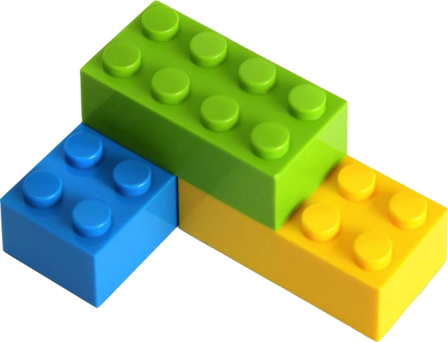
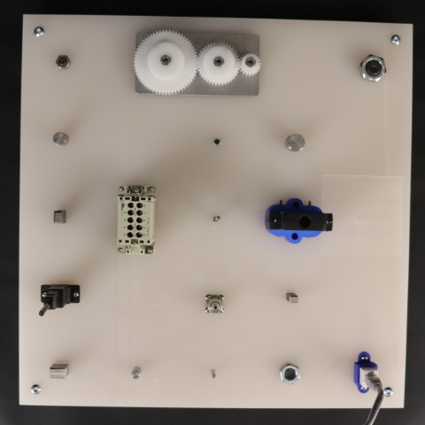

# Robotics Training Center


Robotics Training Center (RTC) is a project funded by [NIST](https://www.nist.gov/) in 2023-2024. The project was proposed by [Carnegie Mellon University](https://www.cmu.edu/) in collaboration with [ARM Institute](https://arminstitute.org/)

The center includes a set of robots repeatedly performing manufacturing and assembly manipulation tasks with an adjustable level of variation. To achieve the vision, the project consisted of five core thrusts:

1. **Self-supervised vision-based object manipulation**
2. **Vibrotactile sensing for monitoring manufacturing processes**
3. **Integration and development of a digital backbone for large-scale data collection and processing in robotics training**
4. Identification of technology adoption incentive mechanisms for manufacturing ecosystems
5. Development of strategies for the transition of the above technologies to the ARM Institute ecosystem

The website is documentation of the robotic system which is result of first three thrust.

*<insert license and collaboration medium>*

### Purpose
* To create robotic skills that can be combined with each other to enable a robot to perform a manufacturing task
* For manufacturing tasks, we focus on the following

|||
|---|---|
|LEGO block assembly|NIST task board #1 (insertion tasks)|

* To create an autonomy pipeline that can be transferred to the [ARM Institute](https://arminstitute.org/) for generalization across the robots that they have, and for extension to other forms of manufacturing tasks, as appropriate


### Contributions

The current version of the robot training center was possible due to team work and contributions from following members

> *David Held, Octavian Donca, Oliver Kroemer, Kevin Zhang, Christopher Chang, Michael Skocik, Henrik Bingemann, Gary Fedder, Rod Heiple, Stephanie Steren Ruta, Shobhit Aggarwal*

### Site Index

* [System Overview](System.md)
* [Video Highlights](Highlights.md)
* [Thrust 1 - Vision System](Vision/Vision.md)
* [Thrust 2 - Vibrotactile System](Vibrotactile/Vibrotactile.md)
* [Thrust 3 - Digital Data Backbone](DDB/DDB.md)
* [Contact](Contact.html)

<!-- ### Environment
There are two environments of reference in this project:
* [The CMU-MFI Testbed]()
* [The ARM RTC robot cell]() -->


```{toctree}
:hidden:
System.md
Highlights.md
Contact.md
```

```{toctree}
:hidden:
:caption: Vision System

Vision/Vision.md
Vision/Installation.md
``` 

```{toctree}
:hidden:
:caption: Vibrotactile System

Vibrotactile/Vibrotactile.md
Vibrotactile/Installation.md
```

```{toctree}
:hidden:
:caption: Digital Data Backbone

DDB/DDB.md
DDB/Installation.md
<!-- DDB/Tutorial.md -->

```